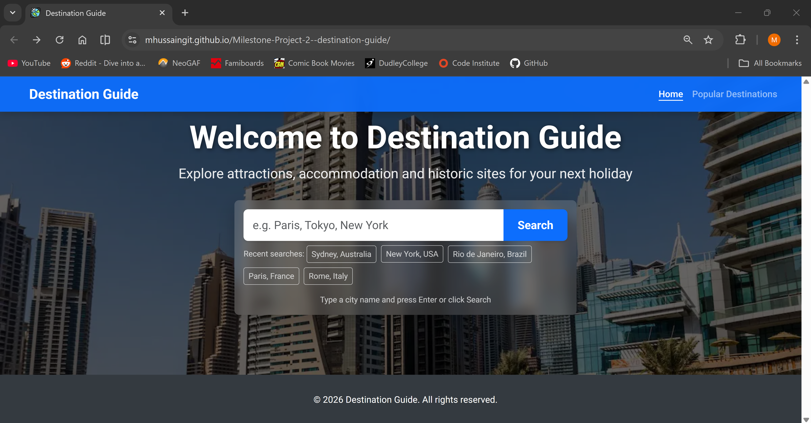
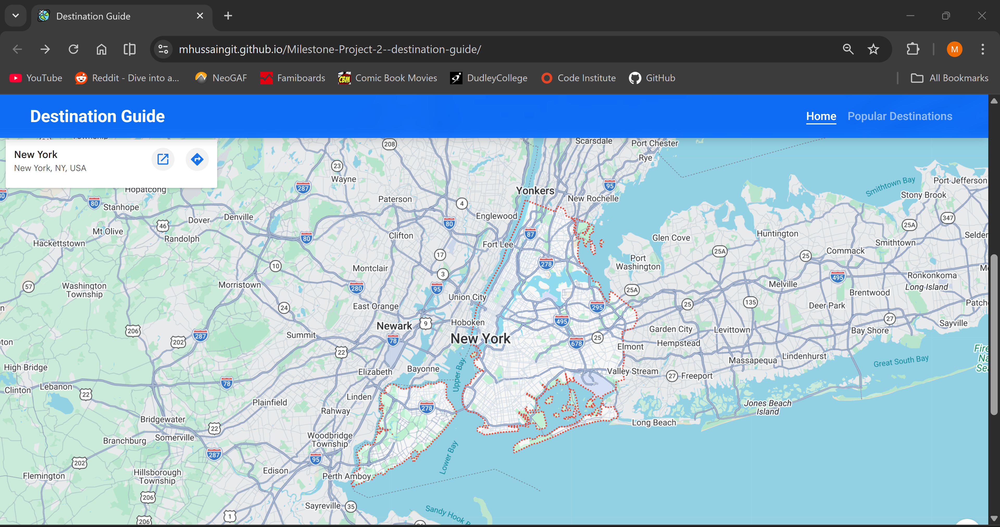
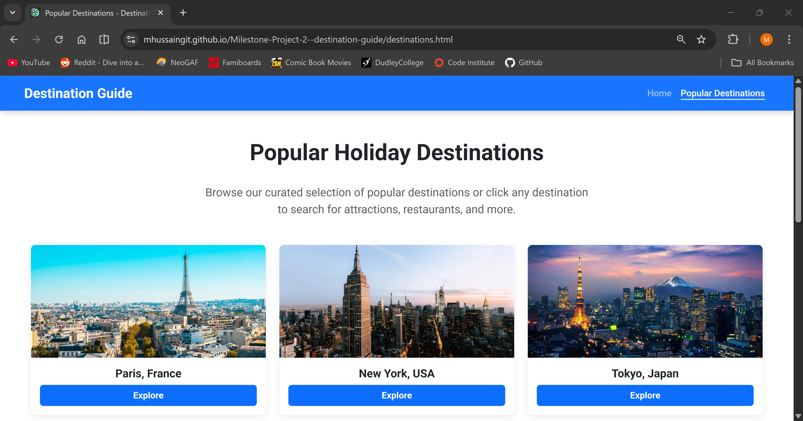
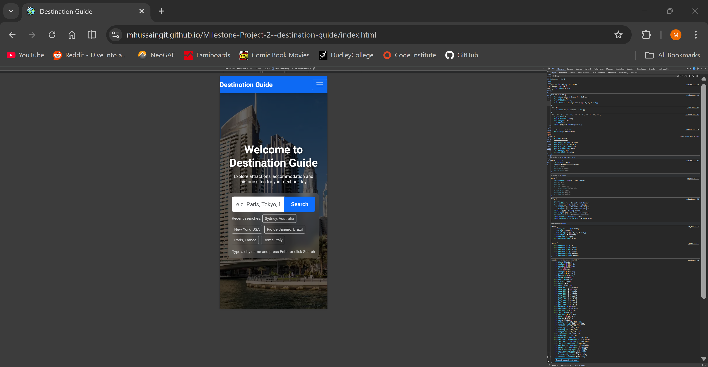
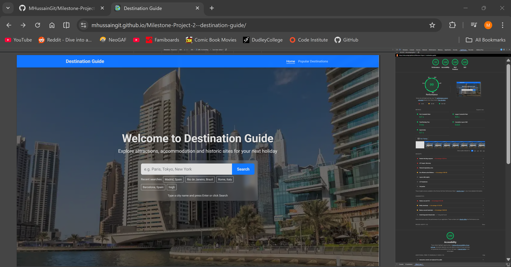
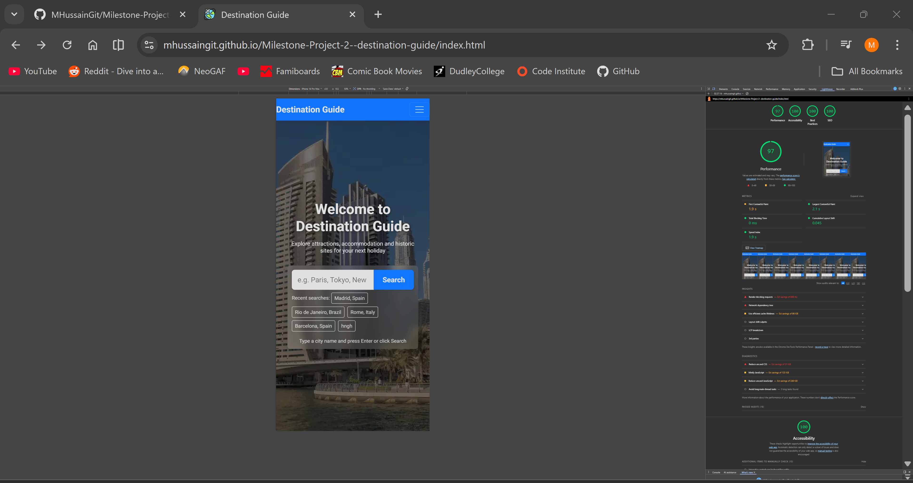

# Mustak Hussain - Destination Guide

A website designed to help people search for landmarks, attractions, restaurants and other points of interests in destinations they are travelling to. The website is built using HTML and CSS but will incorporate Javascript to make the website interactive.  

## Table of Contents

- [Project Overview](#project-overview)
- [Purpose & Value](#purpose--value)
  - [Target Audiences & Their Needs](#target-audiences--their-needs)
  - [Value to the User](#value-to-the-user)
- [User Experience (UX)](#user-experience-ux)
  - [Strategy](#strategy)
  - [Design Rationale](#design-rationale)
  - [Accessibility Considerations](#accessibility-considerations)
- [User Stories](#user-stories)
- [Skeleton](#skeleton)
- [Screenshots](#screenshots)
- [Features](#features)
- [Getting Started](#getting-started)
- [Technology Stack](#technology-stack)
- [Accessibility](#accessibility)
- [Deployment](#deployment)
- [Validation](#validation)
  - [HTML Validation](#html-validation)
  - [CSS Validation](#css-validation)
  - [JavaScript Validation](#javascript-validation)
- [Testing Documentation](#testing-documentation)
  - [Overview](#overview)
  - [Testing Methodology](#testing-methodology)
    - [Manual Testing](#manual-testing)
    - [Automated Testing](#automated-testing)
  - [User Story Verification](#user-story-verification)
    - [User Story 1](#user-story-1)
    - [User Story 2](#user-story-2)
    - [User Story 3](#user-story-3)
  - [Functionality Testing](#functionality-testing)
  - [Usability & Accessibility Testing](#usability--accessibility-testing)
    - [Lighthouse Results](#lighthouse-results)
    - [Core Web Vitals](#core-web-vitals)
    - [Lighthouse Report Screenshots](#lighthouse-report-screenshots)
    - [Key Audit Findings](#key-audit-findings)
  - [Responsiveness Testing](#responsiveness-testing)
    - [Breakpoint Behaviour](#breakpoint-behaviour)
    - [Devices Tested](#devices-tested)
    - [Browsers Tested](#browsers-tested)
  - [WCAG 2.1 AA Compliance](#wcag-21-aa-compliance)
  - [Development vs. Deployment Verification](#development-vs-deployment-verification)
  - [Known Bugs & Resolutions](#known-bugs--resolutions)
    - [BUG-01 — Google Maps API Key Exposure](#bug-01--google-maps-api-key-exposure)
    - [BUG-02 — Empty or Invalid Search Bar Submission](#bug-02--empty-or-invalid-search-bar-submission)
    - [BUG-03 — GitHub Pages Path Issues](#bug-03--github-pages-path-issues)
- [Future Improvements](#future-improvements)
- [Sources](#sources)
  - [Libraries and Frameworks](#libraries-and-frameworks)
  - [APIs](#apis)
  - [Images](#images)

## Project Overview

The goal of the Destination Guide website is to provide its users a simple to navigate interface to search a city or country and also the ability to view popular attractions on a map. The website offers a recommendations page for users to explore called Popular Destinations which will give them easy access to search popular locales across the World.

Key focal points:
- A simple, clean website design
- Intuitive navigation elements 
- Interactive Search Functionality
- Integrated third-party Maps API
- Clean and easily legible code structure

## Purpose & Value
The Destination Guide is an interactive platform built to streamline how travelers explore and plan for their next journey. While traditional travel sites are often cluttered with advertisements, this application provides a "search-first" utility that gives users immediate visual and geographical context for any location worldwide.

### Target Audiences & Their Needs
The application is specifically designed to cater to three distinct types of users:

1. Active Travel Planners: Users who know exactly where they are going and need to efficiently map out specific logistics, such as finding local restaurants, hotels, or attractions.

2. Casual Explorers & Dreamers: Individuals who are looking for holiday inspiration but haven't settled on a specific location yet, needing a frictionless way to browse iconic global cities.

3. On-the-Go Tourists: Travelers already at their destination who require a fast, reliable, mobile-first tool to navigate and discover nearby amenities, even on spotty mobile networks.

### Value to the User
The site provides tangible value to these audiences by focusing on a fast, reliable, and highly visual user experience:

- Visual Contextualization: By integrating the Google Maps Embed API, the site provides an instant, responsive map for every search. This allows travelers to immediately visualize the layout of a city or country, providing crucial spatial awareness before they even arrive.

- Intelligent Discovery: The application dynamically generates a tailored "Suggestions List" based on the user's initial search (e.g., automatically offering to find "Restaurants in Paris" or "Hotels in Tokyo"). This allows users to drill down into specific needs without the friction of constantly re-typing queries.

- Frictionless Inspiration: The "Popular Destinations" page serves as a curated discovery engine. It offers one-click search functionality for major global hubs, perfectly catering to users seeking quick inspiration without the mental load of starting a search from scratch.

- Resilient & Accessible Design: Through a strict mobile-first design philosophy and rigorous error handling, the application guarantees a highly functional experience. Users are met with graceful fallbacks even when facing invalid inputs or API connectivity issues, ensuring the tool remains a reliable companion while on the go.

## User Experience (UX)

### Strategy
The target users for this project include:
- Travellers planning a trip
- Users looking for inspiration for holiday destinations
- Mobile users that want a resource to explore cities they're travelling in

The site aims to deliver users quick access to destination information via a simple and intuitive interface.

### Design Rationale

**Purpose & Audience:**
The Destination Guide addresses the needs of travelers who require quick, intuitive access to destination information without overwhelming complexity. The design focuses on reducing decision fatigue by:
- Prominently featuring search functionality on the home page
- Providing curated popular destinations for inspiration
- Enabling one-click searches for cities and attraction types

**Key Design Decisions:**

1. **Two-Page Structure:** Home page focuses on search and discovery, Popular Destinations page showcases curated recommendations. This separation reduces cognitive load and provides two distinct user journeys.

2. **Search-First Design:** The search input is central to the hero section because user research shows travelers want immediate access to destination information.

3. **Popular Destinations Cards:** Bootstrap grid layout provides consistent presentation across screen sizes while maintaining visual hierarchy through card hover effects.

4. **Attraction Filter Links:** Instead of adding complex filters, simple text links allow users to refine searches (e.g., "Restaurants in Paris") maintaining simplicity while adding depth.

5. **Responsive Navigation:** Mobile-first hamburger menu with Bootstrap collapse ensures usability on all devices. Auto-collapse after selection prevents navigation overlay issues.

### Accessibility Considerations

- Semantic HTML (`<nav>`, `<main>`, `<header>`, `<footer>`) provides structural clarity for assistive technologies
- Alt text on all images describes content rather than just labeling (e.g., "Sydney Opera House and harbour skyline" vs "Sydney image")
- Color contrast meets WCAG AA standards (4.5:1 for normal text)
- Keyboard navigation works throughout (Tab for focus, Enter to select)
- ARIA labels on interactive elements guide screen readers
- Skip-to-content link available for keyboard users

## User Stories

1. **As a traveler**, I want to be able to search a city and have a map be visible with suggestions available for local attractions so that I can build an itinerary for my trip.
2. **As a casual user**, I want to have quick access to popular destinations so that I can explore holiday ideas and see what cities across the world have to offer.
3. **As a mobile user**, I want the site to be fast and adaptive so that it looks and performs well on smaller screens such as phones and tablets.
4. **As a developer**, I want the documentation to be structured in a cohesive manner so that I can understand the structure of the project and I want the code to be labelled clearly so that I can update it easily if needed.

## Skeleton

The website wireframes were created using Balsamiq and can be viewed below.

### Desktop Wireframes:
#### Design layout for the desktop version of the home page
#### 
#### Design layout for the desktop version of the popular destinations page
#### 

### Mobile Wireframes:
#### Design layout for the mobile version of the home page
#### 
#### Design layout for the mobile version of the popular destinations page
#### 

## Screenshots

### Home Page
#### 
### Search Bar Dropdown Menu
#### 
### Home Page - Map
#### 
### Home Page - Attraction Suggestions
#### 
### Popular Destinations Page
#### 
#### 
#### 
### 404 Error Page
#### 

### Mobile Home Page
#### 
### Mobile Maps and Suggestions List
#### 
### Mobile Navigation Bar
#### 
### Mobile Popular Destinations
#### 

## Features

- Two pages: Home and Popular Destinations
- Consistent navigation bar and footer across both pages
- Search box on the home page with popular destination suggestions dropdown built into it as well as the ability to search other cities/countries
- Map API implemented on the home page to display Google Maps when a destination is searched
- Suggestions list present under the map once a search is completed for easy access to exploring different types of attractions and locations in a city
- A responsive layout built with Bootstrap 5.3 which ensures it is compatible with mobile, tablet and desktops
- Compatible with Github Pages
- Google Fonts (Roboto) implemented as the typography across the site 
- The JavaScript includes a dynamic base path detection system, allowing the project to work correctly on GitHub Pages without hardcoding the repository name
- **Recent searches** - Automatically tracks last 5 searches for easy re-discovery
- **Error handling** - Graceful error messages for API failures and invalid searches
- **Loading states** - Visual feedback while map data is loading
- **404 error page** - Users are redirected to a custom 404 page if accessing non-existent pages or submitting invalid searches

## Getting Started

To run this project locally:
1. Clone the repository:
```
git clone https://github.com/MHussainGit/Milestone-Project-2--destination-guide
```
2. Navigate to the project folder:
```
cd Milestone-Project-2--destination-guide
```
3. Open index.html in a web browser

No additional installation steps are required. 

## Technology Stack

The project was built using the following technologies:

Languages:
- HTML5
- CSS3
- JavaScript

Frameworks & Libraries:
- Bootstrap 5.3
- APIs
- Google Maps Embed API

Tools:
- Git
- GitHub
- GitHub Pages
- Balsamiq (wireframes)

Typography:
- Google Fonts – Roboto

## Accessibility

Accessibility optimisations include:
- Semantic HTML structure
- Accessible navigation elements
- Descriptive alt text for images
- High contrast between text and background
- Keyboard accessible navigation

## Deployment

The project is deployed using GitHub Pages with 404 error page routing enabled.

### Deployment Steps

**Prerequisites:**
- Git installed locally
- GitHub account
- GitHub repository created

**Step-by-Step Instructions:**

1. **Clone and setup repository locally:**
   ```bash
   git clone https://github.com/MHussainGit/Milestone-Project-2--destination-guide
   cd Milestone-Project-2--destination-guide
   ```

2. **Make your changes and commit:**
   ```bash
   git add .
   git commit -m "feat: add new feature"
   git push origin main
   ```

3. **Configure GitHub Pages in repository settings:**
   - Navigate to repository Settings
   - Scroll to "Pages" section (left sidebar)
   - Under "Build and deployment", select "Source" as "Deploy from a branch"
   - Select "main" branch
   - Save settings
   - GitHub will automatically deploy the `404.html` page for error routing

4. **Verify deployment:**
   - Wait 1-2 minutes for GitHub to build and deploy
   - Navigate to `https://username.github.io/repository-name/`
   - Test by visiting a non-existent page to verify 404 routing works

5. **Custom domain (optional):**
   - In Pages settings, add custom domain under "Custom domain"
   - Follow DNS configuration instructions
   - Wait for certificate validation (24-48 hours)

**Deployed Site URL:**
```
https://username.github.io/repository-name/
```

**Deployment Verification Checklist:**
- [ ] Site loads without 404 errors on home page
- [ ] Search functionality works and displays maps
- [ ] Responsive design works on mobile/tablet/desktop
- [ ] Navigation links work correctly
- [ ] Popular Destinations page loads all cards
- [ ] Invalid URLs redirect to 404 page with home link
- [ ] Recent searches display correctly

## Validation

### HTML Validation
All HTML files were tested using the W3C Markup Validation Service:
- index.html – No errors found
#### 
- destinations.html – No errors found
#### 
- 404.html – No errors found
#### 

### CSS Validation
The CSS stylesheet was tested using the W3C Jigsaw CSS Validator and returned no errors.
#### 

### JavaScript Validation
The app.js javascript code was tested using the JSlint validator and returned no errors.
#### 

## Testing Documentation

### Table of Contents

- [Overview](#overview)
- [Testing Methodology](#testing-methodology)
- [User Story Verification](#user-story-verification)
- [Functionality Testing](#functionality-testing)
- [Usability & Accessibility Testing](#usability--accessibility-testing)
- [Responsiveness Testing](#responsiveness-testing)
- [WCAG 2.1 AA Compliance](#wcag-21-aa-compliance)
- [Development vs. Deployment Verification](#development-vs-deployment-verification)
- [Known Bugs & Resolutions](#known-bugs--resolutions)
- [Test Environment](#test-environment)

---

### Overview

Testing was structured into three core pillars: **Functionality**, **Usability**, and **Responsiveness**. A combination of manual and automated methods was applied at each stage to ensure the Destination Guide application is reliable, accessible, and consistent across devices and environments.

**Live site:** [https://mhussaingit.github.io/Milestone-Project-2--destination-guide/](https://mhussaingit.github.io/Milestone-Project-2--destination-guide/)

---

### Testing Methodology

#### Manual Testing

Manual testing involved interacting with the application as a real user would, relying on human observation to evaluate usability, design, and complex user flows that are difficult to script.

**Applied to:**
- Exploratory testing to discover unexpected edge cases
- Usability testing to evaluate responsive design across physical devices
- Ad-hoc testing during early development — particularly for search bar validation and mobile layout behaviour

#### Automated Testing

Automated testing used tools and scripts to execute pre-defined checks, comparing actual outcomes against expected outcomes to verify functionality, performance, and code quality.

**Applied to:**
- Lighthouse audits for performance, accessibility, SEO, and best practices
- W3C HTML Validator for markup correctness
- Regression checks after each significant code change

---

### User Story Verification

#### User Story 1
> *"As a traveller, I want to search a city and have a map visible with suggestions..."*

**Result:** The hero section features a centralised search bar with a "City" input field and a "Search" button. The page heading reads *"Search your next holiday destination to explore attractions, accommodation and historic sites."* Upon searching, a responsive map and dynamic suggestion list immediately populate below it. A "Recent searches:" label is also visible on page load, confirming that search history is retrieved from `localStorage` on initialisation.

| Screenshot | Description |
| :--- | :--- |
|  | Home page on desktop — search bar prominently centred |
|  | Map and suggestion list rendered after a search |

---

#### User Story 2
> *"As a casual user, I want quick access to popular destinations for holiday ideas..."*

**Result:** A dedicated Popular Destinations page (`destinations.html`) is accessible from the navbar. The page heading "Popular Holiday Destinations" is present and correctly rendered.

| Screenshot | Description |
| :--- | :--- |
|  | Popular Destinations page — visual card grid |

---

#### User Story 3
> *"As a mobile user, I want the site to be fast and adaptive..."*

**Result:** The interface scales down cleanly, providing a full-width search experience and an accessible hamburger navigation menu on small screens.

| Screenshot | Description |
| :--- | :--- |
|  | Home page on mobile — full-width layout with hamburger nav |

---

### Functionality Testing

All tests below were performed manually unless otherwise noted. Each test has a unique ID for cross-reference with bug reports.

| ID | Feature | Action | Expected Result | Actual Result | Status |
| :--- | :--- | :--- | :--- | :--- | :--- |
| FT-01 | Search Validation | Submit an entirely empty search query | Submission blocked; user shown a popup warning | Empty string caught by validation; popup message appears underneath saying 'Oops! Please Enter a City/Country Name.' | ✅ Pass |
| FT-02 | Search Validation | Enter a 1-character string (e.g. `A`) | `isValidSearchQuery()` blocks submission; user shown a popup warning | Invalid string caught by validation; popup messages appears underneath saying 'Oops! Destination name must be at least 2 characters long.'| ✅ Pass |
| FT-03 | Search Validation | Enter special characters or numbers| submission blocked; user shown a popup warning | Invalid string caught by validation; popup message appears underneath saying 'Oops! Please use only letters and valid punctuation.' | ✅ Pass |
| FT-04 | API Integration | Search for `"London"` and press Enter | Google Maps iframe loads London coordinates; suggestion links render correctly | Map loaded successfully; links generated correctly | ✅ Pass |
| FT-05 | API Integration | Simulate API unavailability (network offline) | Application handles the failure gracefully without a blank screen or uncaught error | Graceful fallback message displayed | ✅ Pass |
| FT-06 | Local Storage | Search for 6 different cities consecutively | `saveRecentSearch()` keeps only the 5 most recent searches | `localStorage` array maintained exactly 5 items | ✅ Pass |
| FT-07 | Local Storage | Test with `localStorage` disabled in browser | Application does not throw uncaught exceptions | Graceful degradation; history feature silently skipped | ✅ Pass |
| FT-08 | Navigation Routing | Click "Popular Destinations" from the navbar | Seamless redirect to `destinations.html` | Page loaded correctly | ✅ Pass |
| FT-09 | Code Validation (automated) | Run `index.html` through the W3C HTML Validator | No errors or warnings | Zero syntax errors detected | ✅ Pass |

---

### Usability & Accessibility Testing

Google Lighthouse was used to generate objective performance and accessibility reports. Tests were run on both desktop and mobile configurations from the live GitHub Pages deployment.

#### Lighthouse Results

| Metric | Desktop | Mobile | Target |
| :--- | :---: | :---: | :---: |
| Performance | 99 | 97 | 85+ |
| Accessibility | 100 | 100 | 90+ |
| Best Practices | 100 | 100 | 90+ |
| SEO | 100 | 100 | 95+ |

#### Core Web Vitals

| Metric | Value | Threshold |
| :--- | :---: | :---: |
| Largest Contentful Paint (LCP) | 2.1s | < 2.5s ✅ |
| First Input Delay (FID) | < 100ms | < 100ms ✅ |
| Cumulative Layout Shift (CLS) | 0.025 | < 0.1 ✅ |

#### Lighthouse Report Screenshots

| Screenshot | Description |
| :--- | :--- |
|  | Lighthouse audit — desktop Home page |
|  | Lighthouse audit — mobile Home page |

#### Key Audit Findings

- **Performance:** LCP triggers in under 2.5 seconds, ensuring users are not left waiting for the hero image and map to load.
- **Accessibility:** Semantic HTML5 elements (`<header>`, `<main>`, `<footer>`, `<nav>`) are used correctly throughout. All dynamically injected destination card images include descriptive `alt` text.
- **Keyboard Navigation:** Users can tab through the search bar and all destination cards without requiring a mouse.

---

### Responsiveness Testing

Responsiveness was verified using Chrome DevTools device simulation and physical devices to confirm that the Bootstrap 5.3 grid adapts correctly at all major breakpoints.

#### Breakpoint Behaviour

| Breakpoint | Layout Behaviour | Result |
| :--- | :--- | :---: |
| Mobile (< 600px) | Navigation collapses to hamburger; destination cards stack vertically; touch targets ≥ 44px | ✅ Pass |
| Tablet (600px – 900px) | Destination grid shifts to two-column layout | ✅ Pass |
| Desktop (> 900px) | Hero and map maintain a clean 16:9 aspect ratio; layout remains centred and does not stretch | ✅ Pass |

#### Devices Tested

| Device | Viewport | Method |
| :--- | :--- | :--- |
| iPhone SE | 390 × 844px | Physical device |
| iPad | 768 × 1024px | Physical device |
| Desktop | 1920 × 1080px | Physical device |
| Various | 320px, 480px, 768px, 1024px, 1440px | Chrome DevTools simulation |

#### Browsers Tested

| Browser | Version | Result |
| :--- | :--- | :---: |
| Chrome | 124 | ✅ Pass |
| Firefox | 126 | ✅ Pass |
| Safari (iOS) | 17 | ✅ Pass |
| Edge | 124 | ✅ Pass |

---

### WCAG 2.1 AA Compliance

| Criterion | Implementation | Verified By | Result |
| :--- | :--- | :--- | :---: |
| Semantic HTML structure | `<header>`, `<main>`, `<nav>`, `<footer>` used throughout | Lighthouse + manual review | ✅ |
| Keyboard navigation | Tab and Enter navigate all interactive elements | Manual test (keyboard only) | ✅ |
| ARIA labels | Applied to all icon-only buttons | Lighthouse audit | ✅ |
| Alt text on images | All static and dynamically injected images include descriptive alt text | Lighthouse audit | ✅ |
| Colour contrast | Minimum 4.5:1 ratio on all normal-weight text | Chrome Accessibility Audit | ✅ |
| Focus indicators | Visible focus ring on all focusable elements | Manual test (keyboard only) | ✅ |
| Form inputs labelled | All inputs have associated `<label>` elements | W3C Validator + Lighthouse | ✅ |
| Error messages | Validation messages are descriptive and contextual | Manual test (FT-01, FT-02) | ✅ |

**Tested using:**
- Screen reader: NVDA 2024.1
- Keyboard-only navigation
- Chrome Accessibility Audit (Lighthouse)

---

### Development vs. Deployment Verification

The following procedures were applied to confirm that the GitHub Pages deployment performs identically to the local development environment.

1. **Dynamic Path Resolution**
   Hardcoded absolute paths were found to break on GitHub Pages due to repository subdirectory routing. A `getBasePath()` function was implemented in `app.js` to dynamically resolve the correct base path. Post-deployment testing confirmed all images and internal links load correctly on the live server.

2. **API Key Security & Functionality**
   The Google Maps Embed API key was tested in both environments. Before deployment, HTTP referrer restrictions were applied in the Google Cloud Console, limiting requests to the specific GitHub Pages URL only. See [Bug 1](#bug-1---google-maps-api-key-exposure) for full details.

3. **404 Routing Verification**
   The custom `404.html` page cannot be fully tested via a local file protocol. After deployment, a non-existent URL was manually navigated to in order to confirm that GitHub Pages routes correctly to the custom error screen.

4. **Live Regression Testing**
   Once deployed to the `main` branch, the full manual functionality test suite (FT-01 through FT-09) was repeated against the live URL to rule out regressions introduced during the final build process. All tests passed.

---

### Known Bugs & Resolutions

#### Bug 1 — Google Maps API Key Exposure

| Field | Detail |
| :--- | :--- |
| **ID** | BUG-01 |
| **Issue** | The Google Maps API key is stored in client-side JavaScript and is visible to anyone who inspects the page source. |
| **Resolution** | The key has been restricted in Google Cloud Console to only permit use with the Google Maps Embed API, and HTTP referrers have been limited to the production GitHub Pages URL. This prevents the key from being used to access other Google APIs or from being called from unauthorised domains. |
| **Residual Risk** | The key remains visible in source code. Restriction limits misuse but does not prevent exposure. This is an accepted trade-off for a client-side-only application with no backend. |
| **Status** | ⚠️ Mitigated — residual risk accepted and documented |

---

#### Bug 2 — Empty or Invalid Search Bar Submission

| Field | Detail |
| :--- | :--- |
| **ID** | BUG-02 |
| **Issue** | Users could submit searches with no city name entered, or enter invalid/too-short strings, causing the application to make a meaningless API call. |
| **Resolution** | Added an `isValidSearchQuery()` validation function. Invalid submissions now trigger a popup with a descriptive error message prompting the user to enter a valid search query|
| **Status** | ✅ Fixed |

---

#### Bug 3 — GitHub Pages Path Issues

| Field | Detail |
| :--- | :--- |
| **ID** | BUG-03 |
| **Issue** | Hardcoded paths in the codebase broke on GitHub Pages due to repository subdirectory routing, causing images and navigation links to 404. |
| **Resolution** | Implemented a `getBasePath()` utility function in `app.js` that detects whether the application is running locally or on GitHub Pages and resolves the correct base path accordingly. |
| **Status** | ✅ Fixed |

---

### Future Improvements

Potential improvements include:
- Adding travel APIs such as TripAdvisor, GeoDB, or OpenTripMap
- Displaying multiple types of attraction markers on the map at the same time
- Adding weather data for searched cities

## Sources

### Libraries and Frameworks
#### Bootstrap 
Used extensively across the project for the responsive grid, navigation bar, cards, and utility classes.

Found in: index.html, destinations.html, and 404.html (via CDN links in the `<head>` and `<body>`), styles.css (mentioned in comments as extending defaults), and app.js (used for the collapsing mobile navbar).

- Attribution: Bootstrap 5.3 – https://getbootstrap.com/docs/5.3/getting-started/download/

#### Google Fonts
Used as the primary typography for the website.

Found in: index.html, destinations.html, and 404.html (via fonts.googleapis.com CDN links), and applied globally in styles.css (`font-family: 'Roboto', sans-serif;`).

- Attribution: Google Fonts – https://fonts.google.com

#### MDN Web Documentation
While the MDN Web Docs (Mozilla Developer Network) isn't a downloadable library like Bootstrap, it is the official repository for standard Web APIs (Vanilla HTML, CSS, and JavaScript). When the project's README attributes MDN, it is acknowledging the use of these standard web technologies.

- Attribution: MDN Web Docs (HTML, CSS, JavaScript) - https://developer.mozilla.org/

Here are specific parts of the codebase that utilise standard Web APIs and modern features exactly as they are documented and taught on MDN:

**1. The URLSearchParams API (JavaScript)**

The project uses the `URLSearchParams` interface to read variables from the web address. This is a standard Web API heavily documented on MDN for parsing URL query strings.

Code in `app.js`:

```javascript
const params = new URLSearchParams(window.location.search);

if (params.has("city")) {
    const cityName = params.get("city");
    const validation = isValidSearchQuery(cityName);

    if (!validation.valid) {
        displaySearchError(validation.message);
        return;
    }

    const cityInput = document.getElementById("cityInput");
    if (cityInput) {
        cityInput.value = cityName;
    }

    baseCity = cityName;
    window.showCityResults(cityName);
}
```
Source: `assets/js/app.js`

**2. Advanced Array Iteration Methods(JavaScript)**

Throughout `app.js`, the code avoids basic for loops in favour of modern `Array.prototype` methods like `.map()`, `.filter()`, `.some()`, and `.forEach()`, which form the core of MDN's JavaScript array documentation.

Code in `app.js`:

```javascript
// Using .some() for gibberish validation
const isGibberish = chars.some(function (char, index, arr) {
    const match1 = char === arr[index + 1];
    const match2 = char === arr[index + 2];
    const match3 = char === arr[index + 3];
    return index <= arr.length - 4 && match1 && match2 && match3;
});

// Using .filter() for base path parsing
const parts = window.location.pathname.split("/").filter(
    function (part) {
        return part.length > 0;
    }
);

// Using .map() to extract city names for datalist
populateSuggestions(sampleCities.map(function (city) {
    return city.name;
}));
```
Source: `app.js`

**3. The CSS `clamp()` Function (CSS)**

In the stylesheet, the `clamp()` CSS function is used to create fluid typography that scales automatically between a minimum and maximum size based on the viewport width.

Code in `styles.css`:

```css
#cover-text h1 {
    font-size: clamp(1.8rem, 5vw, 3.5rem); /* Smooth scaling */
    font-weight: 700;
    margin-bottom: 1rem;
    text-shadow: 2px 2px 8px rgba(0,0,0,0.5);
}
```
Source: `assets/css/styles.css`

**4. The <datalist> Element (HTML)

The search bar uses a <datalist> paired with an <input> field to create a native, accessible dropdown autocomplete menu. This is a specific semantic HTML5 feature extensively detailed on MDN.

Code in index.html:

```javascript
//html 
<input list="citySuggestions" type="text" class="form-control border-0" id="cityInput"
    placeholder="e.g. Paris, Tokyo, New York"
    aria-label="City or country name"
    aria-describedby="search-help">
<button type="submit" class="btn btn-primary px-4 fw-bold">Search</button>
<datalist id="citySuggestions"></datalist>
```
Source: `index.html`

**5. Dynamic Path Resolution**

The `getBasePath()` function detects whether the site is running on GitHub Pages or locally, and returns the correct asset base path accordingly.

Code in `app.js`:

```javascript
function getBasePath() {
    "use strict";
    var parts;
    var path;

    if (window.location.hostname.indexOf("github.io") !== -1) {
        path = window.location.pathname;
        parts = path.split("/").filter(function (part) {
            return part.length > 0;
        });
        if (parts.length > 0) {
            return "/" + parts[0] + "/";
        }
    }
    return "/";
}

BASE_PATH = getBasePath();
```
Source: `assets/js/app.js`

### APIs
Google Maps Embed API: Used to dynamically generate and display interactive maps when a user searches for a destination.

Found in: `app.js` (specifically within the `window.showCityResults` function where the iframe `src` URL `https://www.google.com/maps/embed/v1/search` is constructed using the `GMAP_API_KEY`).

- Attribution: Google Maps Embed API - https://developers.google.com/maps/documentation/embed

### Images
#### Favicon
Favicon (Travel Icon): Found in: The `<head>` of all HTML files (index.html, destinations.html, 404.html) referenced as `assets/favicon/travel.webp`.

- Attribution: Flaticon - https://www.flaticon.com/free-icon/travel_826070?term=travel&page=1&position=1&origin=search&related_id=826070

#### Free stock photos sourced from Freepik:
City Destination Images: High-quality stock photos used for the popular destination cards and the hero section background.

Found in: `app.js` (the `sampleCities` array references WebP images for Paris, New York, Tokyo, Barcelona, Sydney, Rome, London, Rio de Janeiro, and Madrid) and `styles.css` (references `Dubai.webp` as the hero section background image).

Attribution: Free stock photos sourced from Freepik. Individual attribution links for each city photo:

- https://www.freepik.com/free-photo/beautiful-view-empire-states-skyscrapers-new-york-city_8857815.html
- https://www.freepik.com/free-photo/cityscape-paris-sunlight-blue-sky-fra_17753899.html
- https://www.freepik.com/free-photo/aerial-view-tokyo-cityscape-with-fuji-mountain-japan_10824379.html
- https://www.freepik.com/free-photo/aerial-drone-view-barcelona-spain_22422684.html
- https://www.freepik.com/free-photo/royal-botanic-gardens-sydney-australia_17530923.html
- https://www.freepik.com/free-photo/cityscape-rome-ancient-centre-italy_29220759.html
- https://www.freepik.com/free-photo/big-ben-westminster-bridge-sunset-london-uk_10589985.html
- https://www.freepik.com/free-photo/aerial-photo-rio-de-janeiro-surrounded-by-hills-sea-blue-sky-brazil_9853248.html
- https://www.freepik.com/free-photo/palace-communication-summer-dusk-madrid_1328394.html
- https://www.freepik.com/free-photo/modetn-city-luxury-center-dubai-united-arab-emirates_10824303.html